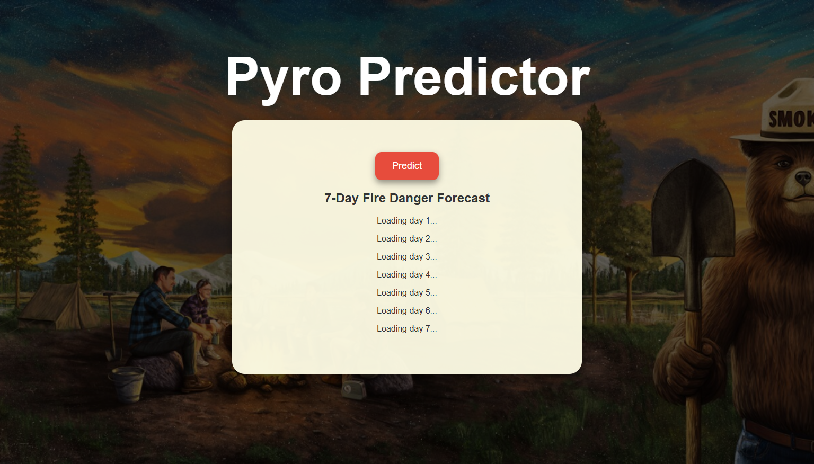

# PyroPredictor-AI
This is PyroPredictor's repository. This is an ai that predicts a fire danger level for a given day with basic weather metrics.
# Usage:
1. Download the repo to your local machine
2. Open the pyropredictor.html file and you should see the following webpage:

3. Click the Predict Button 

The available model and web page is trained on data from los angeles going back to 01/01/2010. When the user clicks the predict button the visual crossing api is called and returns data for the next 7 day forecast. This data includes the dates, max temps for each day, humidity, solar radiation, wind speed, wind gust, precipitation amount, and precipitation cover. Then the data is fed through the trained model and then returns a predicted fire danger level for each day.

# Reasons For Chosen Metrics:
tempmax – Maximum Temperature (°F):
Higher temperatures dry out vegetation and fuels, making them more flammable.
→ Higher temp = higher fire danger.

humidity – Relative Humidity (%):
Low humidity dries out fuels and makes ignition easier.
→ Lower humidity = higher fire danger.

dew – Dew Point (°F):
A lower dew point means drier air and less moisture recovery overnight.
Lower dew = higher fire danger.

precip – Precipitation Amount (inches):
Rain wets fuels and suppresses fire potential.
More rain = lower fire danger.

precipcover – Precipitation Coverage (%):
Shows how widespread rain was. Localized rain may not help much.
More coverage = lower fire danger.

windspeed – Average Wind Speed (mph):
Sustained wind accelerates fire spread and direction.
Higher wind = higher fire danger.

windgust – Wind Gust Speed (mph):
Gusts can trigger spot fires and rapid spread.
Higher gusts = higher fire danger.

solarradiation – Solar Radiation (W/m²):
More sun means drier fuels and higher surface temps.
More solar radiation = higher fire danger.

# Training:
The current model in the repo has been trained based on los angeles as mentioned earlier. The repo has the necessary files to train a new model for a desired location:
DataCollection.py
411PyroPredictor.ipynb

1. Go to the Visual Crossing API website and make an account to acquire an api key
    NOTE: Visual Crossing allows for 1000 data points with free version
2. Open DataCollection.py and replace the YOUR_API_KEY with your key in line 9
3. Replace los%20angeles with desired location
4. Edit desired date range to desired date range
    Given range: 2010-01-01/2025-03-16
5. Run DataCollection.py file to create a csv file that contains all dates, metrics, and fire danger levels for desired date range
